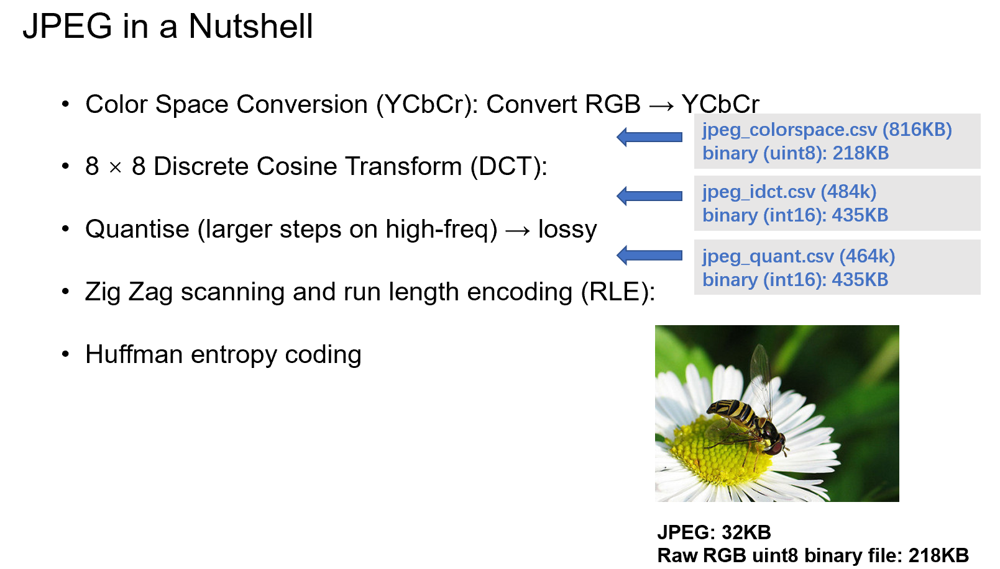
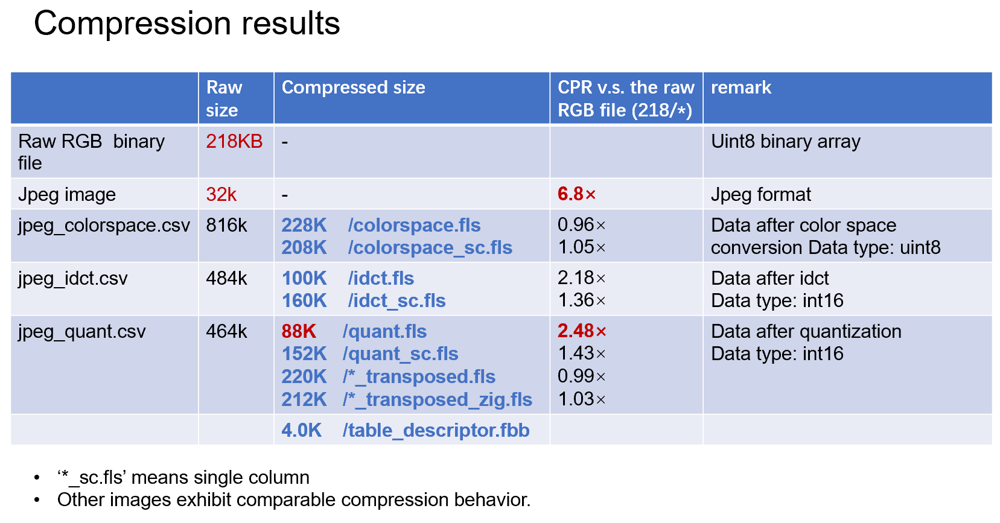

## Example Data
All sample data is located in the `example` directory with the following structure:

```
.
├── example_image                # Sample image
├── jpeg_colorspace              # Color Space Conversion CSV
├── jpeg_colorspace_sc           # Color Space Conversion CSV (single column format)
├── jpeg_idct                    # IDCT processed CSV
├── jpeg_idct_sc                 # IDCT processed CSV (single column format)
├── jpeg_quant                   # Quantized CSV
├── jpeg_quant_sc                # Quantized CSV (single column format)
├── jpeg_quant_transposed        # Quantized and transposed CSV
└── jpeg_quant_transposed_zig    # Quantized, transposed, and zigzag-processed CSV
```

### jpeg_quant Directory Contents

The others are similar.

```
jpeg_quant/
├── jpeg_quant.bin               # int16 binary data
├── jpeg_quant.csv               # CSV for fastlanes
└── schema.json                  # Schema definition
```
## Download Datasets
Run the following command to fetch the data (the dataset remains the same as before), you can use `download_data.sh` to download it:
```sh
sh download_data.sh
```

## Generating Example CSVs
To generate CSV files for sample images (results will be saved in the `tmp` directory):
```sh
make run
```

### Example Scripts
You can specify options to modify directories. 


```sh
make run INPUT_DIR=./flower_photos/daisy OUTPUT_DIR=./tmp
```

**Note:** The current code pads all images into the same CSV (it would be better to separate them). 
I modified the `stb_image.h` to generate the CSVs.
```c
// === CSV FILE handle ===
static FILE  *f_quant, *f_idct, *f_colorsp;
static FILE  *f_quant_sc, *f_idct_sc, *f_colorsp_sc;


static void init_debug_csv_files(const char *output_dir_path) {
    const char *names[] = {
        "jpeg_quant.csv",
        "jpeg_idct.csv",
        "jpeg_colorspace.csv",
        "jpeg_quant_sc.csv",
        "jpeg_idct_sc.csv",
        "jpeg_colorspace_sc.csv"
    };

    FILE **fps[] = {
        &f_quant, &f_idct, &f_colorsp,
        &f_quant_sc, &f_idct_sc, &f_colorsp_sc
    };

    char path[PATH_MAX];
    for (size_t i = 0; i < sizeof(names)/sizeof(*names); ++i) {
        snprintf(path, sizeof(path), "%s/%s", output_dir_path, names[i]);
        *fps[i] = fopen(path, "a+");
        if (!*fps[i]) {
            perror(path);
            exit(EXIT_FAILURE);
        }
    }
}
```

## JPEG Pipeline


## Results


